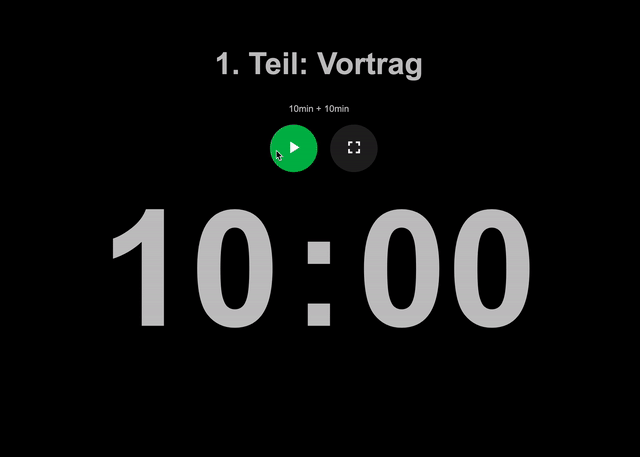
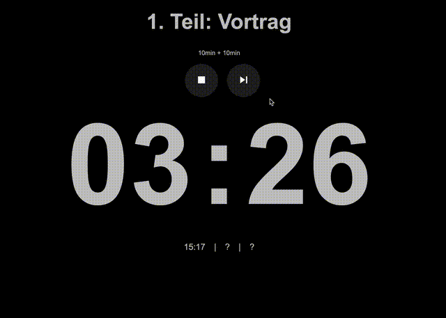
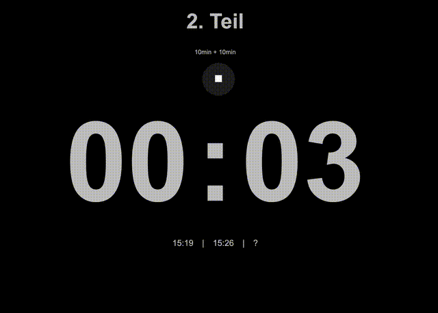

# EtCd - ExamTimeCountDown
 [](https://creativecommons.org/licenses/by-nc/4.0/) 

[](https://mastodon.social/@MrDblH)

## Inhalt
Es lässt sich Prüfungszeit für Prüfling und Prüfungskommision großflächig mit JavaScript und HTML/CSS anzeigen. Es wird (lokal) eine ``index.html``-Datei zur Verfügung gestellt, die die Prüfungszeit _ohne Werbung_ und _ohne weitere unnötige Anzeigen_ auch im Vollbild anzeigen kann.

Im Code sind 2x10 Minuten hinterlegt: Zehn Minuten für den ersten Teil einer Prüfung, meist für einen Vortrag. Dann folgen (hinterlegte) 15 Sekunden für den Übergang zum zweiten Teil, der wiederum zehn Minuten dauert und meist als Kolloquium gestaltet ist.
Es sind _material icons_ eingebunden, die auf [https://fonts.google.com/icons](https://fonts.google.com/icons) zu finden sind. Es wurden die svg-Dateien direkt implementiert, auch damit der _EtCd_ komplett offline in einer Prüfungssituation einsetzbar ist und kein Datenfluss statt findet bzw. statt finden muss.


## Hinweise und Features
- **Vollbildmodus und Schriftgröße:**

    Im Vollbildmodus werden alle Farben ausgegraut und der Countdown steht im klaren Fokus. Für den Übergang wird eine andere Hintergrundfarbe angezeigt.
    Der Vollbildmodus muss nicht genutzt werden, kann aber genutzt werden. Im Vollbildmodus wird stets die ganze Displaybreite ausgenutzt, weshalb (meistens) die Ansicht des _EtCd_ vollständig sein dürfte. Falls die Schriften bzw. die Anzeigen nicht passen sollten, könnte mit dem Zoomen im Browser selbst gearbeitet werden:
    ``strg+ +/-`` für win bzw. ``cmd+ +/-`` für macOS und Linuxbenutzer nehmen Änderungen am Code vor...

- **Skippen:**

    Wird der erste Teil der Prüfung vorzeitig beendet, kann dieser abgebrochen bzw. die restliche Zeit übersprungen werden.


- **Protokoll:**

    Unterhalb der Zeitanzeige werden die zu notierenden Zeiten für das Protokoll angezeigt: Die _Startzeit_ der Prüfung wird beim Drücken auf den grünen Start-Button angezeigt, Zeit, zu der ggf. der erste Teil beendet wurde und als _Startzeitpunkt des zweiten Teils_ benutzt wird, und und der _Zeitpunkt_ des Beendens der Prüfung. Diese dienen lediglich zur Orientierung.

- **Läuft im Browser:**

    Projekt besteht aus einer ``index.html``-Datei, die in einem beliebigen Browser geöffnet wird. Im gleichen Ordnner wie jene ``index.html`` liegen zwei Ordner: ``css`` und ``js``. Im Ordner ``css`` liegt eine Datei, die die Formatierungen übernimmt, die Datei ``timer.js``im Ordner ``js`` übernimmt die Funktionalität des _EtCd_.

- **flugzeugmoduskompatibel**

    Jegliche Dateien wie Icons oder Funktionalitäten sind offline verfügbar und müssen weder vor- noch nachgeladen werden: kein Datenfluss zu googlefonts oder anderen JavaScript-Dateien, keine Tracking jeglicher Art.

- **Zeiten ändern:**

    Die Standardwerte sind
    -   10 Minuten für den ersten Teil (Vorteil),
    -   15 Sekunden Pause für einen Übergang,
    -   10 Minuten für den zweiten Teil.

    Die Zeit des ersten Teils und des zweiten Teils können nicht getrennt voneinander gesteuert werden. Die Werte können in den ersten Zeilen der ``timer.js`` im Order ``js`` geändert werden:
    ```html
    const pruefungszeit_je_teil_minutes = 10; // in min
    const pruefungszeit_uebergang_minutes = 0.25; // in min => 15sec;
    ```
    Für diese Änderungen muss die ``timer.js`` in einem beliebigen Textedior geöffnet und bearbeitet werden.
    Die Übergangszeit  ist keine Pausenzeit für den Prüfling und kommt auch im Protokoll nicht vor. Aus diesem Grund ist dieser Wert für die Pausenzeit sinnvollerweise sehr niedrig zu wählen. Es soll dem Prüfling lediglich eine minimale Zeit für den Übergang in ein neues Thema oder ergänzende Fragen mit ggf. weiterem schriftlichem Input geben.


- **Text-Anzeige ändern:**

    Die Standardwerte sind
    -   für den ersten Teil: _1. Teil: Vortrag_
    -   für den Übergang: _Übergang_
    -   für en zweiten Teil: _2. Teil_.

    Die Werte können in den ersten Zeilen der ``timer.js`` im Order ``js`` geändert werden und werden weiter unten übernommen:
    ```html
  const pruefungsteil_1_text = "1. Teil: Vortrag";
    const pruefungsteil_2_text = "2. Teil";
    const pruefungsteil_uebergang_text = "Übergang";
    const pruefungsteil_reset_text = "- zurückgesetzt -";
    ```
    Für diese Änderungen muss die ``timer.js`` in einem beliebigen Textedior geöffnet und bearbeitet werden.


## Installation
Das gitHub-Projekt clonen oder die zip-Datei herunterladen. Die zip-Datei entpacken und danach die ``index.html`` öffnen.


## Lizenz und Haftung
Creative Commons Attribution-NonCommercial 4.0 International [(CC BY-NC 4.0) ](https://creativecommons.org/licenses/by-nc/4.0/)
Ohne Gewähr, jeder ist für die Benutzung dieser Dateien selbst verantwortlich und sollte diese Dateien lediglich zur Unterstzützung und Ergänzung einsetzen und _nicht_ als einzige Stoppuhr.


## Screenshots




