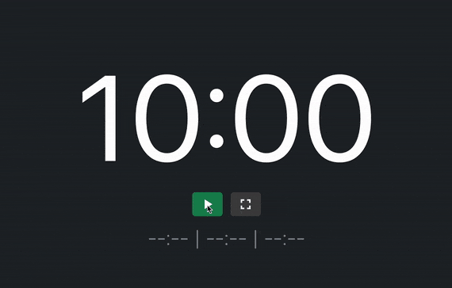

# ExamTimeCountDown
 [](https://creativecommons.org/licenses/by-nc/4.0/) 

[](https://mastodon.social/@MrDblH)

## Überblick
Es lässt sich Prüfungszeit für Prüfling und Prüfungskommision großflächig mit JavaScript und HTML/CSS anzeigen. Es wird (lokal) eine ``index.html``-Datei zur Verfügung gestellt, die die Prüfungszeit _ohne Werbung_ und _ohne weitere unnötige Anzeigen_ auch im Vollbild anzeigen kann. An den meisten Smartphones nutzbar, da responsive programmiert.

Im Javascript-Code sind 2x10 Minuten hinterlegt: Zehn Minuten für den ersten Teil einer Prüfung, meist für einen Vortrag. Dann folgen (hinterlegte) etwa 10 Sekunden für den Übergang zum zweiten Teil, der wiederum zehn Minuten dauert und meist als Kolloquium gestaltet ist.
Es sind _material icons_ eingebunden, die auf [https://fonts.google.com/icons](https://fonts.google.com/icons) zu finden sind. Es wurden die svg-Dateien direkt implementiert, auch damit der _ExamTimeCountDown_ komplett offline in einer Prüfungssituation einsetzbar ist und kein Datenfluss statt findet bzw. statt finden muss.

Es wird Bootstrap für das Layout benutzt.


## Hinweise und Features
- **Vollbildmodus und Schriftgröße:**

    Für den Übergang wird eine andere Hintergrundfarbe angezeigt.
    Der Vollbildmodus muss nicht genutzt werden, kann aber genutzt werden. Falls die Schriften bzw. die Anzeigen nicht passen sollten, könnte mit dem Zoomen im Browser selbst gearbeitet werden:
    ``strg+ +/-`` für win bzw. ``cmd+ +/-`` für macOS und Linuxbenutzer nehmen Änderungen am Code vor...

- **Skippen:**

    Wird der erste Teil der Prüfung vorzeitig beendet, kann dieser abgebrochen bzw. die restliche Zeit des ersten Teils übersprungen werden.


- **Protokoll:**

    Unterhalb der Zeitanzeige werden die zu notierenden Zeiten für das Protokoll angezeigt: Die _Startzeit_ der Prüfung wird beim Drücken auf den grünen Start-Button angezeigt, Zeit, zu der ggf. der erste Teil beendet wurde und als _Startzeitpunkt des zweiten Teils_ benutzt wird, und der _Zeitpunkt_ des Beendens der Prüfung. Diese dienen lediglich zur Orientierung und dürfte korrekt abgebildet sein.

- **Läuft im Browser:**

    Projekt besteht aus einer ``index.html``-Datei, die in einem beliebigen Browser geöffnet wird. Im gleichen Ordnner wie jene ``index.html`` liegen zwei Ordner: ``css`` und ``js``. Im Ordner ``css`` liegt eine Datei, die die Formatierungen übernimmt, die Datei ``timer.js``im Ordner ``js`` übernimmt die Funktionalität des _EtCd_.

- **flugzeugmoduskompatibel**

    Jegliche Dateien wie Icons oder Funktionalitäten sind offline verfügbar und müssen weder vor- noch nachgeladen werden: kein Datenfluss zu googlefonts oder anderen JavaScript-Dateien, kein Tracking jeglicher Art.

- **Zeiten ändern:**

    Die Standardwerte sind
    -   10 Minuten für den ersten Teil,
    -   10 Sekunden Pause für einen Übergang,
    -   10 Minuten für den zweiten Teil. Dieser kann wiederum auf zwei Teile aufgeteilt werden.

    Die Zeit des ersten Teils und des zweiten Teils können getrennt voneinander gesteuert werden. Die Werte können in den ersten Zeilen der ``timer.js`` im Order ``js`` geändert werden:
    ```html
    var pruefungszeit_teil_1 = 10; // in min, Kommazahlen erlaubt
    var pruefungszeit_teil_2 = 10; // in min, Kommazahlen erlaubt
    ```
    Zusätzlich kann ein graphischer Rahmen für den ersten Teil im zweiten Prüfungsteil angezeigt werden: In Baden-Württemberg ist die für die Kombinations-Prüfung aus Gemeinschaftskunde und Geographie sinnvoll (vgl. [RP-BW, pdf](https://rp.baden-wuerttemberg.de/fileadmin/RP-Internet/Tuebingen/Abteilung_7/Fachberater/_DocumentLibraries/Documents/rpt_gk_abi-kombipruefung_2020-11.pdf)). Anzugeben ist die Zeit des ersten Teils, generell sind das etwa drei Minuten; Standard-Wert sind aber 0 Minuten:
    ```html
    var pruefungszeit_teil_2_davon_teil_1 = 0; // in min, Kommazahlen erlaubt
    ```
    Natürlich muss dieser Wert zwingend kleiner als der zugewiesene Wert für ```pruefungszeit_teil_2``` sein.

    In der Zeile
    ```html
    var pruefungszeit_uebergang = 0.17; // in min => 10sec (0.17min);
    ```
    kann eine gewisse Übergangszeit eingestellt werden: Zeit für Orga, zum Durchatmen und für den Übergang in den zweiten Teil. Das Display zeigt einen blauen Hintergrund an.

    Für diese Änderungen muss die ``timer.js`` in einem beliebigen Texteditor geöffnet und bearbeitet werden.
    Die Übergangszeit  ist keine Pausenzeit für den Prüfling und kommt auch im Protokoll nicht vor. Aus diesem Grund ist dieser Wert für die Pausenzeit sinnvollerweise sehr niedrig zu wählen. Es soll dem Prüfling lediglich eine minimale Zeit für den Übergang in ein neues Thema oder ergänzende Fragen mit ggf. weiterem schriftlichem Input geben und damit für etwas Entspannung sorgen.

- **Server Zeitversatz einstellen:**

    Der Standardwert ist 0 Stunden, da meist die angezeigte Protokollzeit der lokalen Uhrzeit entspricht. Falls es Unstimmigkeiten geben sollte, lässt sich das in der ``timer.js`` in mit der folgenden Zeile ändern:
    ```html
    const server_versatz = 0 // in h; 2 => +2h
    ```

- **Screen Wake Lock Api:**

    Manche Browser unterstützen, dass der Bildschirm _nicht_ abgedunkelt wird und das Endgerät _nicht_ in den StandBy-Modus versetzt wird. Dies sollte lediglich dann erfolgen, wenn der Timer gestartet wurde. Leider scheint das noch nicht bei allen zuverlässig zu funktionieren. Aktuelle Implementierungen der Wake Lock Api können auf [caniuse.com](https://caniuse.com/wake-lock) nachgelesen werden. Abhilfe schaffen dann auch die Einstellungen am Geräte selbst (geräteweit).


## Installation
Das gitHub-Projekt clonen oder die zip-Datei herunterladen. Die zip-Datei entpacken und danach die ``index.html`` öffnen. Das Projekt ist [hier](https://github.com/Mr-DblH/examTimeCountDown) zu finden. Alternativ kann unter [ExamTime1](https://www.mrdblh.de/apps/examTime/) (2x 10min) und unter [ExamTime2](https://www.mrdblh.de/apps/examTime2/) (1x (3min+7min), 1x10min; Kombiprüfung)


## Lizenz und Haftung
Creative Commons Attribution-NonCommercial 4.0 International [(CC BY-NC 4.0) ](https://creativecommons.org/licenses/by-nc/4.0/)
Ohne Gewähr, jeder ist für die Benutzung dieser Dateien selbst verantwortlich und sollte diese Dateien lediglich zur Unterstzützung und Ergänzung einsetzen und _nicht_ als einzige Stoppuhr. Das Ausführen des Codes _kann_ unter Umständen zu Abweichungen zwischen der gestoppten und der realen Zeit führen.


## Screenshots



